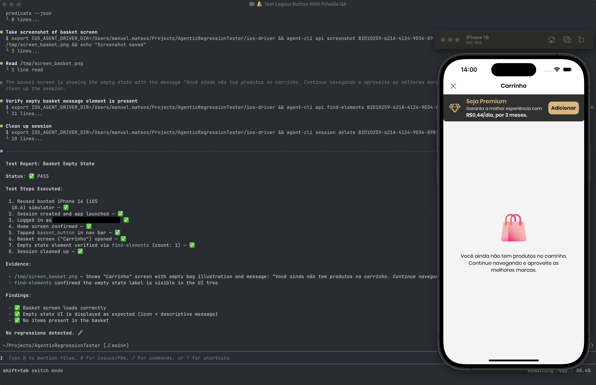

# AgenticRegressionTester



## Overview

AgenticRegressionTester is a tool for auto-discovering and executing regression tests for iOS projects using LLMs and AI agents.

The motivation behind this tool is the tedious nature of writing UI tests with frameworks like KIF or screenshot-testing — and how even more painful it becomes when a UI or flow change breaks those tests. By leveraging LLMs, an agent autonomously discovers what to test guided by a simple natural language prompt, repeating actions as needed to reach its goal:

```
Using the your-project QA skill, test that the logout button works correctly
```

---

## Key Ideas

1. **QA Skill** — The power of this tool largely comes from the use of a QA skill. This skill must be **installed and customized** before you start testing. A skill encodes project-specific context: app name, bundle ID, known flows, and test scenarios.

2. **One skill per target** — A skill is associated with one and only one target (project name + app bundle ID). This allows multiple sub-agents to test different applications in parallel, each agent using a different skill tailored exclusively to its app.

---

## Design Decisions

1. **CLI over MCP** — A CLI was preferred over an MCP implementation for AI agent integration. This provides a cleaner context for the agent and allows combining CLI output with other system tools in a more powerful and flexible way.

2. **iOS Simulator only** — Currently the tool supports UI testing exclusively on the iOS Simulator.

---

## Components

### `ios-driver`
An iOS project that acts as a bridge to access your app via the XCTest API, similar in style to Appium's [WebDriverAgent](https://github.com/appium/WebDriverAgent). It exposes a JSON HTTP API with 25+ endpoints for element interaction, screenshots, assertions, and more.

### `agent-cli`
The CLI used by the AI agent to communicate with `ios-driver`. It exposes commands for session management, app interaction, and skill generation — all consumable by LLM agents.

---

## Installation

Run the install script from the repository root:

```bash
./install.sh
```

This will:

1. ✅ Build the `agent-cli` and install it globally as `/usr/local/bin/agent-cli` (requires `sudo`)
2. ✅ Check and optionally install [Tuist](https://tuist.io) if missing
3. ✅ Detect and configure the `IOS_AGENT_DRIVER_DIR` environment variable in your shell profile
4. ✅ Install skill templates to `~/.agent-cli/skill`
5. ✅ Generate a QA skill for your app (asks for product name and bundle ID)

> ⚠️ `IOS_AGENT_DRIVER_DIR` **must** be visible in your shell for the CLI to function. It points to the `ios-driver` directory so the CLI can install the XCTest driver on each simulator as needed.

After installation, restart your terminal (or `source` your shell profile) to apply the environment variable.

---

## Quick Start

Once installed:

```bash
# Create a test session on a simulator
agent-cli session create --device "iPhone 15" --ios 17.5

# Launch your app
agent-cli api launch-app <session-id> com.example.yourapp

# Get the UI accessibility tree
agent-cli api get-ui-tree <session-id>

# Take a screenshot
agent-cli api screenshot <session-id> --output screen.png

# Delete the session when done
agent-cli session delete <session-id>
```

Then instruct your LLM agent:

```
Using the myapp-qa-skill, test that the logout button works correctly
```

---

## Demo

Here it is a demo video that shows how we use it at **Privalia Brazil**. Enjoy!

https://github.com/user-attachments/assets/c853521c-0548-4e65-ac6a-34d8aced8ad2

Prompt used:
```
using the privalia qa agent, test the logout button
```

You will see in the video that the connection with de Agent Driver is lost, but the agent is clever enought to recreate it, in order to continue with the testing session.

---

## References

Each component has its own detailed documentation:

- [`ios-driver/README.md`](ios-driver/README.md) — XCTest HTTP driver setup, API reference, and configuration
- [`agent-cli/README.md`](agent-cli/README.md) — CLI commands, session management, skill generation, and JSON output

## License

MIT License - Free to use

**Author**: manelix  
**GitHub**: [github.com/manelix2000](https://github.com/manelix2000)

Copyright (c) 2026 manelix

Permission is hereby granted, free of charge, to any person obtaining a copy
of this software and associated documentation files (the "Software"), to deal
in the Software without restriction, including without limitation the rights
to use, copy, modify, merge, publish, distribute, sublicense, and/or sell
copies of the Software, and to permit persons to whom the Software is
furnished to do so, subject to the following conditions:

The above copyright notice and this permission notice shall be included in all
copies or substantial portions of the Software.

THE SOFTWARE IS PROVIDED "AS IS", WITHOUT WARRANTY OF ANY KIND, EXPRESS OR
IMPLIED, INCLUDING BUT NOT LIMITED TO THE WARRANTIES OF MERCHANTABILITY,
FITNESS FOR A PARTICULAR PURPOSE AND NONINFRINGEMENT. IN NO EVENT SHALL THE
AUTHORS OR COPYRIGHT HOLDERS BE LIABLE FOR ANY CLAIM, DAMAGES OR OTHER
LIABILITY, WHETHER IN AN ACTION OF CONTRACT, TORT OR OTHERWISE, ARISING FROM,
OUT OF OR IN CONNECTION WITH THE SOFTWARE OR THE USE OR OTHER DEALINGS IN THE
SOFTWARE.
